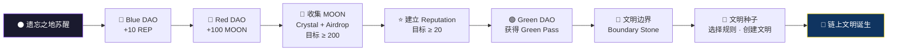

# 🌙 Chain Civilization: Genesis

> **在遗忘之地苏醒，穿越三座 DAO 聚落，以 MOON 为血、以 Reputation 为信、以 Pass 为钥——在文明边界，铸造属于你的链上共识。**

[](https://unity.com/)
[](https://docs.unity3d.com/Packages/com.unity.render-pipelines.universal@latest)
[](https://docs.microsoft.com/en-us/dotnet/csharp/)
[](https://github.com/Oppenseagull/ChainCivilization)
[](https://open.bigmodel.cn/)

---

## ✨ 一句话介绍

**Chain Civilization: Genesis** 是一款第三人称开放世界 Web3 教育游戏原型——玩家在 Unity 构建的「链上文明实验场」中，通过探索、交互与 AI 对话，亲手走完 **Token → Reputation → DAO Pass → Civilization** 的完整文明演化路径。

---

## 🜂 项目背景

Web3 的核心概念——**Token、身份、治理、共识**——对新手而言往往抽象而遥远。

**Chain Civilization: Genesis** 诞生于黑客松现场的一个问题：

> *如果 Web3 不是文档里的术语，而是一片可以行走、触摸、对话的世界，会怎样？*

我们将 DAO 治理、Token 激励、准入机制与文明创建，翻译成**可玩的第三人称旅程**。玩家不再「阅读 Web3」，而是** lived through Web3**——在三个理念迥异的 DAO 聚落中做出选择，最终抵达文明边界，写下第一条链上规则。

本项目面向：

- 🏆 **黑客松评委** — 完整可演示的 15–30 分钟体验闭环
- ⛓️ **Web3 开发者** — 将链上概念映射为可交互游戏系统的参考实现
- 🎮 **游戏开发者** — Unity 6 + Manager 架构 + AI NPC 集成的可复用模板
- 🌍 **GitHub 访问者** — 开箱即玩的 Web3 文明实验世界

---

## 🌌 世界观设定

你从**遗忘之地（The Forgotten Lands）**苏醒。

天空漂浮着区块与哈希的幽灵——`BLOCK`、`HASH`、`DAO`、`TOKEN`、`CONSENSUS` 在穹顶间流转，提醒着：这里曾是链上文明的遗迹。

远方，三座 DAO 聚落以不同颜色标记各自的理念：

| 聚落 | 理念 | 象征 |
|------|------|------|
| 🔵 **Blue DAO** | 开放协作 · Open Collaboration | 任何人皆可贡献，Reputation 即信任 |
| 🔴 **Red DAO** | 贡献与激励 · Market Civilization | Token 流通驱动文明增长 |
| 🟢 **Green DAO** | 准入与治理 · Access Civilization | 身份与凭证决定参与资格 |

你需要：

- 收集 **MOON** — 链上资源的原型货币
- 积累 **Reputation** — 社区认可的可信记录
- 获取 **DAO Pass** — 穿越边界的链上身份凭证

当 MOON 与 Reputation 达到 Green DAO 的门槛，你将获得 **Green Pass**，抵达**文明边界（Boundary Stone）**——

在那里，**文明种子（Civilization Seed）** 等待着你。

新的规则。新的货币。新的共识。

**这一切，都将由你定义。**

---

## 🎮 核心玩法

| 系统 | 描述 |
|------|------|
| 🗺️ **第三人称开放世界探索** | Starter Assets 第三人称控制器，低多边形开放地图，路径石与信标引导 |
| 🏛️ **DAO 交互** | 三座 DAO 石碑，各代表一种治理哲学；首次靠近触发理念介绍卡 |
| ⭐ **Reputation 系统** | Blue DAO 贡献 +10 REP；Red DAO 捐赠 50 MOON → +20 REP |
| 🌙 **MOON 经济系统** | Red DAO 首次领取 100 MOON；Moon Crystal 采集 +50；地图 Airdrop +10 |
| 🎫 **DAO Pass 系统** | 满足 MOON ≥ 200 & REP ≥ 20 后，进入 Green 区域自动获得 Green Pass |
| 🏴 **Civilization Creation** | 在边界选择文明类型，触发创世纪仪式，生成旗帜与「My Civilization」标记 |
| 🤖 **AI Agent NPC** | 大祭司 **Priest Z.AI** 基于 GLM API，实时解答 Web3 概念 |

**世界氛围系统：**

- `BlockchainSkySystem` — 程序化区块链天空层
- `AirdropSpawner` — 地图散布 20 枚可收集空投币
- `DistantLandmarkSystem` / `HologramCityGenerator` — 远景地标与全息城市
- `SceneBeautyDirector` — 场景美学统筹

---

## 🧭 游戏流程



### 主线七步（Main Quest）

| 步骤 | 任务 | 关键交互 |
|:----:|------|----------|
| 1 | 寻找 Blue DAO | 靠近 `BlueDAO_Core` → 按 **E** → Reputation +10 |
| 2 | 访问 Red DAO | 靠近 `RedDAO_Core` → 按 **E** → 首次获得 100 MOON |
| 3 | 获得 MOON | 采集 Moon Crystal（+50）与 Airdrop（+10），累计 ≥ 200 |
| 4 | 建立信誉 | Blue DAO 贡献或 Red DAO 捐赠（50 MOON → +20 REP），累计 ≥ 20 |
| 5 | 获得 Green Pass | 进入 `GreenDAO_EntryZone`，自动发放 Green Pass |
| 6 | 前往文明边界 | 抵达 `BoundaryStone`，阅读多阶段 Lore |
| 7 | 创建文明 | 与 `CivilizationSeed` 交互 → 选择文明规则 → 创世纪仪式 |

### 三种文明类型

| 类型 | 英文名 | 第一条规则 |
|------|--------|------------|
| 开放协作 | Open Collaboration Civilization | *Open collaboration rises above closed walls.* |
| 自由贸易 | Free Trade Civilization | *Free exchange creates shared value.* |
| 知识共享 | Shared Knowledge Civilization | *Knowledge belongs to every builder.* |

### 操作指南

| 按键 | 功能 |
|------|------|
| **WASD** | 移动 |
| **Shift** | 奔跑 |
| **Space** | 跳跃 |
| **E** | 交互 |
| **Tab** | 身份 / 地址 / 地图面板 |
| **F** | 任务日志 |
| **J** | 文明日志 |
| **G** | Demo 流程面板（评委专用） |
| **V** | 文明理念手册 |

---

## 🔮 AI Agent — High Priest（大祭司）

在遗忘之地的路旁，悬浮着一位神秘的存在——**Priest Z.AI（大祭司）**。

他并非普通 NPC。他是连接「游戏世界」与「链上知识」的**神谕接口**：

- 回答 **DAO、Blockchain、Token、Wallet、Reputation、Governance、Consensus** 等问题
- 以**神秘、哲学、简洁**的口吻，将 Web3 概念翻译为文明演化叙事
- 基于 **智谱 GLM-4-Flash** 实时生成回复，支持多轮对话

**交互方式：** 靠近 `Priest_NPC` → 按 **E** → 打开 TextMeshPro 对话面板 → 输入问题 → 发送

**技术实现：**

```
AgentNPC（ proximity + E 键 ）
    └── AgentUI（ TMP 对话界面 ）
            └── GLMAgent（ GLM API 客户端 ）
```

> 💡 API Key 配置方式见下方「如何运行」章节。

---

## 🏗️ 技术架构

### 技术栈

| 类别 | 技术 |
|------|------|
| 引擎 | **Unity 6**（6000.4.10f1） |
| 语言 | **C#** |
| 渲染 | **Universal Render Pipeline (URP) 17.4** |
| UI | **TextMeshPro** · UGUI · OnGUI 混合 HUD |
| 角色控制 | **Starter Assets — Third Person Controller** |
| 相机 | **Cinemachine 3.1** |
| 输入 | **Unity Input System 1.19** |
| AI | **智谱 GLM API**（`glm-4-flash`） |
| 开发工具 | **Unity MCP**（`com.coplaydev.unity-mcp`）· **Cursor** |
| 版本管理 | **GitHub** |

### 系统架构图

```mermaid
flowchart TB
    subgraph Player["🎮 Player（SampleScene）"]
        TM["TokenManager<br/>MOON 余额 · PlayerPrefs"]
        RM["ReputationManager<br/>REP 追踪 · 一次性奖励"]
        DPM["DAOPassManager<br/>Green Pass 凭证"]
        CM["CivilizationManager<br/>文明类型 · 静态会话"]
        MQM["MainQuestManager<br/>7 步主线 · 距离 HUD"]
        QLU["QuestLogUI<br/>F 键任务日志"]
        MBU["MoonBalanceUI<br/>MOON/REP HUD"]
        APU["AddressPanelUI<br/>Tab 身份面板"]
        CJU["CivilizationJournalUI<br/>J 键文明日志"]
    end

    subgraph DAO["🏛️ DAO Layer"]
        Blue["BlueDAOSteleInteract"]
        Red["RedDAOSteleInteract"]
        Green["GreenDAOSteleInteract"]
        Entry["DAOPassEntryZone"]
        Req["DAORequirements<br/>MOON≥200 · REP≥20"]
    end

    subgraph World["🌍 World Layer"]
        Crystal["MoonCrystalInteract"]
        Airdrop["AirdropSpawner / AirdropCoin"]
        Boundary["BoundaryTrigger"]
        Seed["CivilizationSeedInteract"]
        Sky["BlockchainSkySystem"]
    end

    subgraph Civ["🏴 Civilization Layer"]
        Panel["CivilizationSeedRulePanel"]
        Flag["CivilizationFlagSpawner"]
        Marker["CivilizationMarkerSpawner"]
        Climax["CivilizationClimaxUI<br/>创世纪仪式"]
        Notice["RuleNotice · CompleteNotice"]
    end

    subgraph AI["🔮 AI Layer"]
        NPC["AgentNPC"]
        UI["AgentUI"]
        GLM["GLMAgent<br/>GLM-4-Flash API"]
    end

    subgraph Quest["📜 Quest Layer"]
        QS["QuestSignals<br/>会话标志"]
    end

    Blue --> RM
    Blue --> QS
    Red --> TM
    Red --> RM
    Green --> Req
    Entry --> Req
    Entry --> DPM
    Req --> TM
    Req --> RM

    Crystal --> TM
    Airdrop --> TM
    Boundary --> DPM
    Boundary --> QS
    Seed --> Panel
    Panel --> CM
    CM --> Flag
    CM --> Marker
    CM --> Climax
    CM --> MQM

    MQM --> TM
    MQM --> RM
    MQM --> DPM
    MQM --> CM
    MQM --> QS
    QLU --> MQM

    MBU --> TM
    MBU --> RM
    MBU --> DPM
    APU --> TM
    APU --> RM

    NPC --> UI
    UI --> GLM

    style Player fill:#0d1117,stroke:#58a6ff,color:#c9d1d9
    style DAO fill:#161b22,stroke:#7C3AED,color:#c9d1d9
    style World fill:#161b22,stroke:#3fb950,color:#c9d1d9
    style Civ fill:#161b22,stroke:#FFD700,color:#c9d1d9
    style AI fill:#161b22,stroke:#FF6B35,color:#c9d1d9
    style Quest fill:#161b22,stroke:#f0883e,color:#c9d1d9
```



### 数据流概览

```
探索 DAO / 采集资源
       ↓
TokenManager（MOON）+ ReputationManager（REP）
       ↓
DAORequirements 校验 → DAOPassManager（Green Pass）
       ↓
BoundaryTrigger（Lore + 准入校验）
       ↓
CivilizationManager.SelectCivilization()
       ↓
FlagSpawner + MarkerSpawner + ClimaxUI（创世纪仪式）
       ↓
MainQuestManager → Complete ✓
```

---

## 📁 项目结构

```
ChainCivilization/
├── Assets/
│   ├── Scenes/
│   │   └── SampleScene.unity          # 主场景（唯一玩法场景）
│   ├── Scripts/
│   │   ├── AI/                        # GLMAgent · AgentNPC · AgentUI
│   │   ├── Civilization/              # 文明种子 · 规则面板 · 旗帜 · 仪式 UI
│   │   ├── Core/                      # DAORequirements · GameSaveKeys · 共享类型
│   │   ├── DAO/                       # Blue / Red / Green DAO 交互
│   │   ├── Managers/                  # Token · Reputation · DAOPass · Civilization
│   │   ├── Quest/                     # MainQuestManager · QuestLogUI · QuestSignals
│   │   ├── Tools/                     # GroundSnapUtility · 放置规则
│   │   ├── UI/                        # HUD · 地图 · Demo 面板 · 欢迎界面
│   │   ├── Visual/                    # 地标工厂 · 场景美学 · 全息城市
│   │   └── World/                     # 水晶 · 边界 · 空投 · 区块链天空
│   ├── StarterAssets/                 # 第三人称控制器（第三方）
│   ├── Resources/                       # 字体 · 场景美学预制体
│   ├── Editor/                        # Priest NPC 场景工具 · 低多边形改造
│   └── [Art Assets]/                  # Polytope Studio · ithappy Cartoon City 等
├── Packages/
│   └── manifest.json                  # URP · Input System · Cinemachine · Unity MCP
├── ProjectSettings/
├── ArchitectureReport.md              # 架构评估报告
├── ProjectStructure.md                # 脚本结构规范
└── README.md                          # 本文件
```

### 场景关键对象

| 对象 | 职责 |
|------|------|
| `Player` | 挂载全部 Manager 与 UI 组件 |
| `BlueDAO_Core` / `RedDAO_Core` / `GreenDAO_Core` | 三座 DAO 石碑 |
| `GreenDAO_EntryZone` | Green Pass 触发区 |
| `MoonCrystal_01` ~ `05` | 可采集月亮水晶 |
| `BoundaryStone` + `Boundary_Zone` | 文明边界与创世纪区域 |
| `CivilizationSeed` | 文明创建交互点 |
| `Priest_NPC` | 大祭司 AI Agent |
| `AgentChatCanvas` | AI 对话 UI |

---

## 🚀 如何运行

### 环境要求

- **Unity Hub** + **Unity 6000.4.10f1**（或兼容的 Unity 6 版本）
- 磁盘空间 ≥ 2 GB
- （可选）智谱 GLM API Key — 启用大祭司 AI 对话

### 步骤 1 — 克隆仓库

```bash
git clone https://github.com/Oppenseagull/ChainCivilization.git
cd ChainCivilization
```

### 步骤 2 — 用 Unity 打开项目

1. 打开 **Unity Hub**
2. 点击 **Add** → 选择克隆下来的 `ChainCivilization` 文件夹
3. 确认 Editor 版本为 **6000.4.10f1**
4. 等待 Package 解析与首次导入完成（URP、Input System、Starter Assets 等）

### 步骤 3 — 打开主场景

```
Assets/Scenes/SampleScene.unity
```

双击打开，确认 Build Settings 中该场景已启用。

### 步骤 4 — 配置 AI（可选但推荐）

大祭司 **Priest Z.AI** 需要 GLM API Key，任选一种方式：

**方式 A — 环境变量（推荐）**

```bash
# Windows PowerShell
$env:ZHIPU_API_KEY = "your-api-key-here"

# macOS / Linux
export ZHIPU_API_KEY="your-api-key-here"
```

**方式 B — 本地密钥文件**

在项目根目录创建（已在 `.gitignore` 中排除）：

```
LocalSecrets/zhipu_api_key.txt
```

文件内容为你的 API Key，无多余空格。

**方式 C — Inspector 配置**

选中场景中 `Priest_NPC` → `GLMAgent` 组件 → 填入 **Api Key** 字段。

> 未配置 API Key 时，游戏仍可完整体验主线；AI 对话将返回友好错误提示。

### 步骤 5 — Play 测试

1. 点击 Unity **Play ▶**
2. 首次启动显示欢迎面板 → 按 **E** 开始
3. 按 **G** 打开 Demo 流程面板，跟随七步主线
4. 靠近 `Priest_NPC` 按 **E**，测试 AI 对话

### 评委快速体验路径（≈ 15 分钟）

```
苏醒 → Blue DAO → Red DAO → 采集 Crystal → Green Pass
     → 边界石碑 → 文明种子 → 选择规则 → 创世纪仪式 ✓
```

---

## 🔭 未来规划

| 阶段 | 方向 |
|------|------|
| **Phase 1 — 链上对接** | MOON / REP / Pass 映射至真实 Testnet 合约；钱包连接（MetaMask / WalletConnect） |
| **Phase 2 — 多 DAO 生态** | 动态 DAO 参数、链上治理投票、玩家间 Reputation 互认 |
| **Phase 3 — 文明持久化** | 文明规则上链存证；跨玩家可见的链上文明地图 |
| **Phase 4 — AI 深化** | High Priest 接入 RAG 知识库；多 Agent 协作（Oracle · Scribe · Herald） |
| **Phase 5 — 多人世界** | Netcode 多人探索；DAO 间资源竞争与协作 |

---

## 👥 团队成员

| 成员 | 角色 | 联系 |
|------|------|------|
| **Oppenseagull** | 项目负责人 · 全栈开发 · 游戏设计 | [GitHub](https://github.com/Oppenseagull) |

> 本项目为黑客松期间快速迭代产物，欢迎 Issue 与 PR。

---

## 📄 License

本项目目前**尚未附带开源 License 文件**。

- 黑客松演示版本：© 2026 Chain Civilization Team
- 如需二次开发或商业使用，请联系项目维护者

---

<p align="center">
  <strong>🌙 在遗忘之地，每一个选择都在写入链上的历史。</strong><br/>
  <em>Chain Civilization: Genesis — Where Web3 Becomes a World.</em>
</p>

<p align="center">
  <a href="https://github.com/Oppenseagull/ChainCivilization">⭐ Star this repo</a>
  &nbsp;·&nbsp;
  <a href="https://github.com/Oppenseagull/ChainCivilization/issues">Report Issue</a>
</p>
